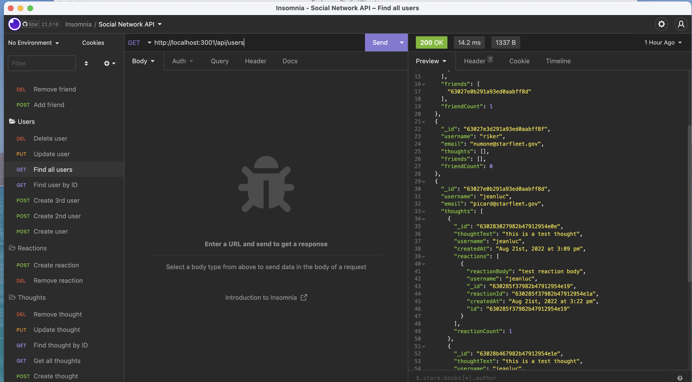

# Social Network API

## Description

The purpose of this project was to build an API for a social network web application where users can share their thoughts, react to friends’ thoughts, and create a friend list.

## Table of Contents

- [Installation](#installation)
- [Usage](#usage)
- [License](#license)
- [Contributions](#contributions)
- [Testing](#testing)
- [Questions](#questions)

## Installation

Installation requires MongoDB, mongoose, express, moment, and nodemon. Contact me for further instructions!

## Usage

Here's a link to a video showing basic operation: [Google Drive Link](https://watch.screencastify.com/v/KpA0fwex7v9NM0ovnxGh)

## License

Copyright © 2022 [Caren Merz](https://github.com/cammeer).  
This project is [MIT](https://github.com/cammeer/next-progress-bar/blob/main/LICENSE) licensed.

## Contributions

I was the only contributor to this project. If you would like to contribute, see my email below.

## Tech

- JavaScript
- Node.js
- MongoDB database
- Mongoose ODM
- Express.js for routing
- Nodemon
- Moment.js
- Insomnia

## Testing

Testing was conducted via [Insomnia](https://insomnia.rest/)

## Any Questions?

This project was created by me: [cammeer](https://github.com/cammeer)

Contact me with any questions at: [caren@merzhaus.org](caren@merzhaus.org)
